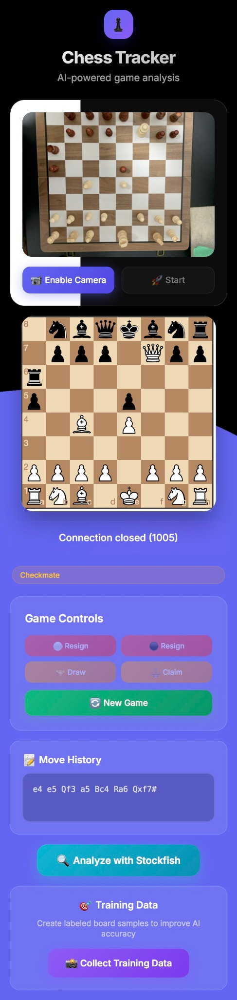
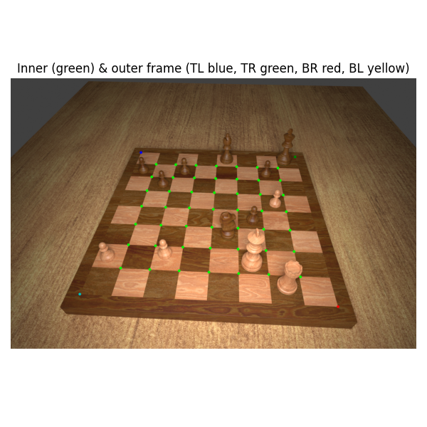
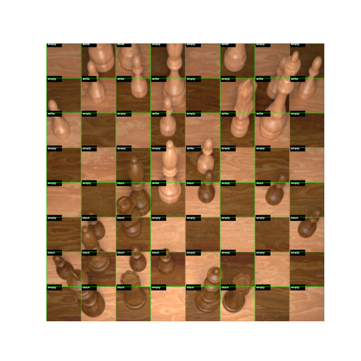
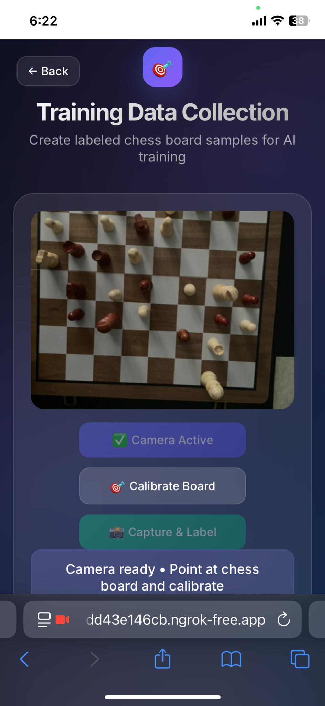
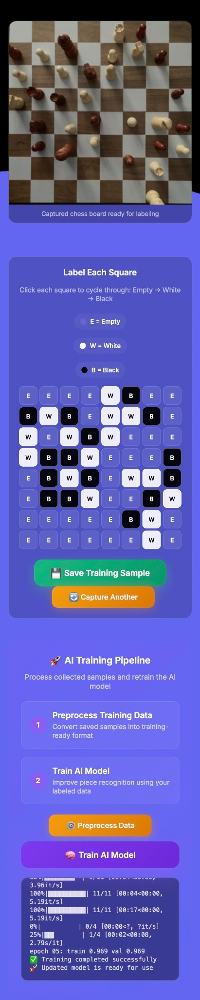
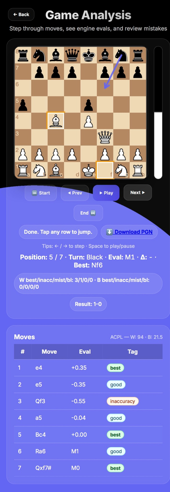

# Chess Tracker — AI-powered OTB Board Tracking & Analysis

Use your **phone camera** to detect a real chessboard, classify every square (empty / white / black) with a lightweight CNN, reconstruct positions & moves, and **analyze the game with Stockfish** in a clean, mobile-first UI.

> **Note**: This is a live **board tracker & analysis tool**, not an official “scorekeeper.” It infers positions and moves from vision; use PGN export at your discretion.

<p align="center">
  
</p>

---

## ✨ Features

- **One-tap calibration** — lock onto the board via homography.
- **Real-time square classification** — 64 crops → CNN (Empty/White/Black).
- **Position & move reconstruction** — FEN/PGN with move history.
- **Engine review** — Stockfish evals, best-move arrows, ACPL & mistake tags.
- **Built-in dataset tooling** — capture, label, preprocess, and retrain from your phone.
- **Mobile-first UI** — fast interactions, large controls, smooth animations.

---

## 📸 Gallery

| Corner & grid detection | Square classification | Data capture (mobile) |
|---|---|---|
|  |  |  |

| Manual labelling UI | In-game tracker | Post-game analysis |
|---|---|---|
|  |  |  |

---

## 🧠 How it Works

Phone Camera (WebRTC)
        │
        ▼
Board Calibration → Perspective Warp (800×800)
        │
        ▼
Split into 64 Square Crops (N×N)
        │
        ▼
Tiny CNN → {empty, white, black} per square
        │
        ▼
Board State → Move Diff → FEN/PGN
        │
        ├─▶ UI (live board, history)
        └─▶ Stockfish (evals, best lines)


- **Vision**: OpenCV for corner finding & top-down warp.  
- **Model**: PyTorch CNN trained on synthetic boards + your captured patches.  
- **Engine**: Stockfish (UCI).  
- **App**: FastAPI backend, vanilla JS + chessboard.js frontend.

---

## 🚀 Quickstart

> Prereqs: Python 3.10+, `pip`, and Stockfish.  
> macOS: `brew install stockfish`

# Clone
git clone https://github.com/skankhunt44/Chess-Notation.git
cd Chess-Notation

# (Optional) venv
python -m venv .venv
source .venv/bin/activate   # Windows: .venv\Scripts\activate

# Install
pip install -r requirements.txt

# Run server (adjust module name if different)
uvicorn app:app --reload     # or: python -m uvicorn main:app --reload

# Optional: expose over the internet
ngrok http 8000

### First run
1. Enable Camera and point at the whole board (White at bottom).
2. Calibrate Board (grid should align with squares).
3. Start to track.
4. Analyze with Stockfish to step through lines, evals, and best moves.
5. Collect Training Data to improve accuracy on your setup.

## 🏗️ Project Structure (simplified)
```text
chess_cnn/                 # CNN training / inference
assets/
  model.pt                 # Latest trained model
data/
  session_*/               # Captured frames/crops per session
  crops_my_cam/            # User-labeled crops
static/                    # Frontend (HTML/CSS/JS, chessboard.js)
training_pipeline.py       # Preprocess + train orchestration
app.py (or main.py)        # FastAPI app + routes / websockets
'''text

## 🧪 Training & Improving the Model

### Train from the UI
1. Collect Training Data → Calibrate → Capture & Label.
2. Click each square to cycle E → W → B, then Save Training Sample.
3. Preprocess Data (builds training set).
4. Train AI Model (writes assets/model.pt).
5. Tracker hot-loads the new model.

### CLI (example)
# Preprocess
python training_pipeline.py --cmd preprocess \
  --data_dir data/crops_my_cam --out data/processed

# Train
python training_pipeline.py --cmd train \
  --epochs 10 --batch_size 64 --lr 3e-4 \
  --model_out assets/model.pt

> Validation split is grouped by board id to avoid leakage across crops.

## 🔌 API (selected)

- POST /calibrate — base64 image → homography/corners.
- POST /capture_label — persist one 64-square labelled sample (E/W/B).
- POST /preprocess — convert samples to training-ready format.
- POST /train — fine-tune CNN; stream logs to UI.
- WS /stream — push live frames / board states.
(Endpoint names may differ slightly—see the code/UI bindings.)

## ⚙️ Tips & Configuration

- Orientation: ensure White at the bottom when calibrating.
- Lighting: diffuse light reduces tall-piece shadows and boosts accuracy.
- Camera: if possible, lock exposure/focus to prevent flicker.
- Engine: set multipv ≥ 2 to see alternative best lines in analysis.
- Animations: prefer CSS transforms over full board re-draws for smooth moves.

## 🧰 Troubleshooting

- “Board not found”
Make sure the whole board is visible; improve border contrast; recalibrate.
- Blank calib_fail.jpg
Guard against corners is None before drawing overlays.
- Connection closed (1005) on mobile
Reconnect WebSocket on visibilitychange; Safari sometimes drops idle connections.
- Checkmate shows as “check”
Verify final position flags before rendering result labels.

## 📈 Roadmap

- Classify piece types (not just occupancy).
- Tournament mode (multi-board + syncing).
- Cloud training jobs & model registry.
- Export to Lichess/Chess.com studies.

## 🙏 Acknowledgements

- Synthetic Chess Board Images (Kaggle).
- OpenCV, PyTorch, FastAPI, Stockfish, chessboard.js, chess.js.
